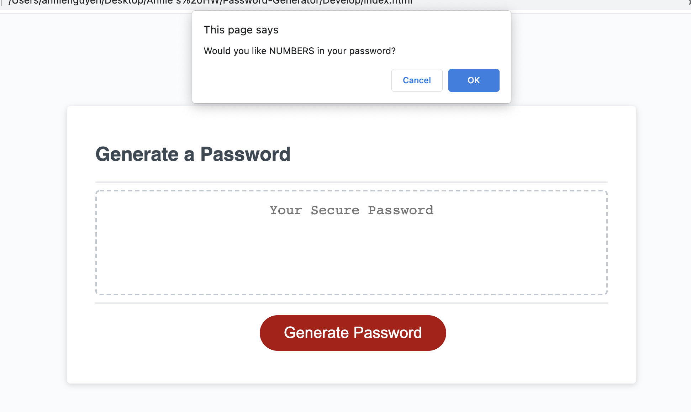

# 03 JavaScript: Password Generator

## Overview
I created an application that allows a user to create a strong, random password based on the criteria that I provided. Users can select the number of characters in their desired password between 8 and 128 characters. They can also have a combination of uppercase and lowercase letters, special characters, and numbers. 

The following images shows the web application's appearance:

## Links

https://github.com/annielnguyen/Password-Generator
https://annielnguyen.github.io/Password-Generator/
